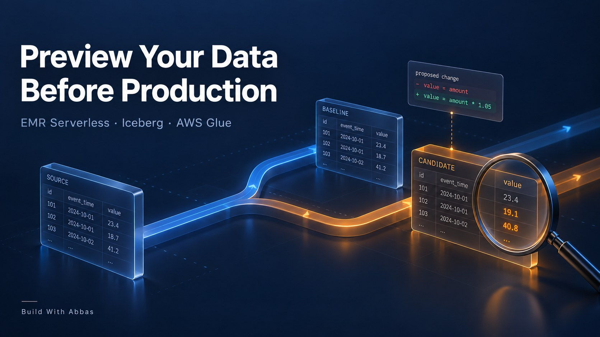
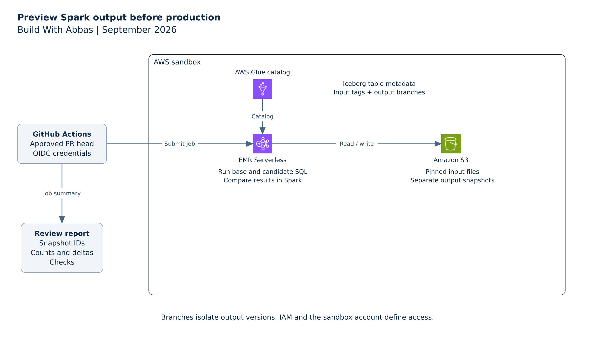
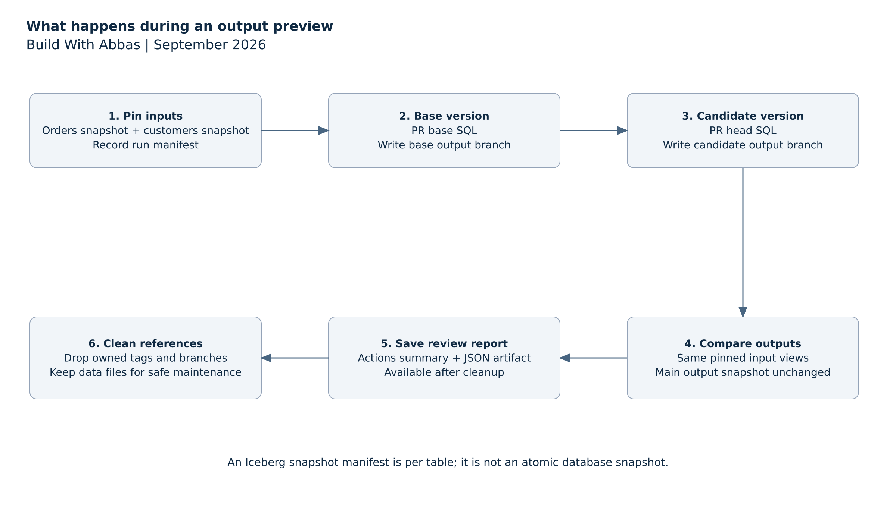

# Stop creating table_test: preview your EMR output before you merge



Have you ever changed a Glue or EMR job and wondered what the output would actually look like once it reached production?

The code review looks reasonable. The tests pass. But the change touches a join, a filter or a calculation, and you still want to see the resulting data before you approve it.

So you write to `orders_test`. Someone else needs their own version, which becomes `orders_test_v2`. A week later, the catalog contains `orders_test_final`, and nobody is quite sure which code produced it or whether its input matches today's data.

Those tables started with a sensible goal: give the change somewhere to run. The missing piece is a repeatable way to connect the code being reviewed, the input it read and the output it produced.

I wanted a pull request to answer a more useful question: **if both versions of this transformation read the same input, what changes in the result?**

This walkthrough builds that preview around Amazon EMR Serverless, the AWS Glue Data Catalog and Apache Iceberg tables in S3. A run captures input snapshot IDs, executes the base and candidate SQL, and writes each result to its own Iceberg branch. The reviewer gets a comparison before merging the code.

The example uses EMR Serverless as its execution engine. AWS Glue provides the catalog; this is not a wrapper that automatically executes an existing Glue ETL job.

## A small code change with a visible consequence

Consider an order summary grouped by customer region. The existing transformation counts every order:

```sql
SELECT c.region,
       count(*) AS orders,
       sum(o.amount_cents) AS revenue_cents
FROM input_orders o
JOIN input_customers c
  ON o.customer_id = c.customer_id
GROUP BY c.region
```

The proposed change excludes cancelled orders:

```sql
WHERE o.status = 'COMPLETE'
```

That line is easy to review in GitHub. Its effect is harder to judge from the diff alone. How many orders disappear? Which regions change? Does the join still produce the expected groups?

A preview should make those consequences visible. It should also keep yesterday's input and today's input from getting mixed into the comparison.

The sample dataset has 10,000 orders and 100 customers. Exactly 1,000 orders are cancelled. Amounts are stored as integer cents so the comparison does not depend on floating-point rounding.

## The AWS architecture



GitHub Actions submits the work through the EMR Serverless API. The runner receives temporary AWS credentials through OpenID Connect, then uploads the job and SQL files to a location named for that run.

EMR starts Spark with the Iceberg runtime supplied by the release. Spark uses the Glue catalog to resolve table metadata and reads or writes the underlying files through S3. The comparison happens inside the same Spark job, so this example does not need a separate query service.

The CloudFormation template creates a dedicated sandbox bucket, Glue database, EMR application and IAM roles. The execution role can access that sandbox's data and catalog entries. It has no permissions to your existing production tables through this template.

I chose EMR Serverless 7.12.0 for the package. AWS lists Spark 3.5.6 and Iceberg 1.10.0 for that release. Keeping the supplied Iceberg runtime avoids mixing an independently downloaded runtime into the EMR classpath. [EMR release details](https://docs.aws.amazon.com/emr/latest/ReleaseGuide/emr-7120-release.html).

The job uses this catalog configuration:

```text
spark.sql.extensions=org.apache.iceberg.spark.extensions.IcebergSparkSessionExtensions
spark.sql.catalog.lake=org.apache.iceberg.spark.SparkCatalog
spark.sql.catalog.lake.catalog-impl=org.apache.iceberg.aws.glue.GlueCatalog
spark.sql.catalog.lake.io-impl=org.apache.iceberg.aws.s3.S3FileIO
```

The runner adds the warehouse location from the stack's bucket output and loads `/usr/share/aws/iceberg/lib/iceberg-spark3-runtime.jar`. Credentials come from the EMR execution role. [AWS configuration guide](https://docs.aws.amazon.com/emr/latest/EMR-Serverless-UserGuide/using-iceberg.html).

## Keep the input still while the code changes

Comparing a candidate with the current output table is not always a fair test. That output might have been produced hours earlier, before new orders arrived or customer records changed.

Instead, the job reads the current snapshot ID of each input table and saves those IDs in a run manifest. Both transformations then read the same versions through temporary Spark views:

```python
spark.sql(f"""
    CREATE OR REPLACE TEMP VIEW input_orders AS
    SELECT * FROM lake.pr_preview_lab.orders
    VERSION AS OF {orders_snapshot_id}
""")
```

The customers view follows the same pattern. The SQL files refer to `input_orders` and `input_customers`, which gives the preview runner control over the input versions without changing the transformation itself.

The job also creates temporary tags for the captured input snapshots. These references keep the snapshots reachable during the preview's retention window. Recording a snapshot ID alone would not protect it from a maintenance process that expires unreferenced snapshots.

There is a limit here that matters for joins: the orders and customers snapshot IDs are captured separately. Iceberg does not turn that pair into an atomic snapshot of the whole database. If your pipeline requires both tables to represent exactly the same ingestion batch, supply a manifest from that completed batch instead of independently selecting each table's latest snapshot.

## Give each output its own branch

Iceberg branches let a table retain separate snapshot histories. Creating a branch references an existing snapshot; the transformation writes new data files when it produces its result. [Iceberg branch writes](https://iceberg.apache.org/docs/latest/spark-writes/).

For each preview, the job creates two branches on `order_totals`: one for the base transformation and one for the candidate. A branch name includes the pull request number, commit prefix and run attempt so a rerun gets its own references.

The write is explicitly directed at the branch:

```python
spark.sql(f"""
    ALTER TABLE lake.pr_preview_lab.order_totals
    CREATE BRANCH {branch}
    AS OF VERSION {output_snapshot_id}
    RETAIN 1 DAYS
""")

spark.sql(f"""
    INSERT OVERWRITE
    lake.pr_preview_lab.order_totals.branch_{branch}
    SELECT region, orders, revenue_cents
    FROM proposed_output
""")
```

The base transformation runs again on the pinned input, even though an output already exists on the main branch. That extra run makes the comparison about the code change rather than the age of the previous output.

Both results remain queryable long enough for the job to compare them. The job records the output table's main snapshot before and after the preview and fails its check if that snapshot changes. This is a useful assertion in the isolated sandbox. In a system with concurrent production writers, a changed main snapshot would need a more careful explanation than simply blaming the preview.

Branches operate at table level, and a table's schema is shared across its branches. This example is for transformation changes with a stable output schema. It is not a safe way to trial arbitrary schema migrations against a production table.

## Run the example in an AWS sandbox

The package includes the infrastructure template, Spark job, runner, SQL files, workflows and integration tests. Download it from **[GitHub repository link]**.

Authenticate the AWS CLI to your sandbox account and choose a Region that supports the selected EMR release. You will also need Python 3.11 or newer and permissions to deploy the resources in the template. The setup guide covers existing GitHub OIDC providers and accounts that use Lake Formation permissions.

From the repository directory:

```bash
python3 -m venv .venv
source .venv/bin/activate
python -m pip install -r aws/requirements.txt

bash aws/deploy.sh
source artifacts/aws-env.sh
```

The deployment helper prints the account identity before creating the stack. It writes the stack outputs into the environment file used by the commands below.

Seed the synthetic dataset once:

```bash
python aws/run.py --action seed \
  --bucket "$BUCKET" --application "$APP" \
  --role "$ROLE" --namespace "$DATABASE" \
  --run pr_1_000000000001_r1
```

The seed job deliberately refuses to replace existing tables. Run the bundled cancellation-filter example with a fresh run identifier:

```bash
python aws/run.py \
  --bucket "$BUCKET" --application "$APP" \
  --role "$ROLE" --namespace "$DATABASE" \
  --run pr_1_000000000002_r1
```

Under the hood, `aws/run.py` uploads the code and calls `start_job_run`. The request supplies the application ID, execution role, S3 entry point, Spark configuration and an execution timeout. It then waits for EMR to reach a terminal state and retrieves the comparison from S3.

A failed Spark job fails the runner. A successful submission alone does not count as a successful preview.

## What the reviewer sees

The report contains the input snapshot IDs, both outputs, per-region deltas and structural checks. The included example produces this comparison in the local Spark and Iceberg integration test:

| Region | Orders before | Orders after | Revenue change, cents |
|---|---:|---:|---:|
| EU | 3,400 | 3,000 | -850,000 |
| UK | 3,300 | 3,000 | -600,000 |
| US | 3,300 | 3,000 | -675,000 |
| Total | 10,000 | 9,000 | -2,125,000 |

The change removes the expected 1,000 orders. Revenue falls from 22,375,000 cents to 20,250,000 cents, about 9.5%. The regional breakdown gives the reviewer something more specific to investigate than a green job status.

The engine test runs real Spark 3.5.6 and Iceberg 1.10.0 against a local catalog and local files. It also exercises new input arriving after snapshot capture, a failed candidate query and repeated cleanup. These results establish the behavior of the preview logic; they are not measurements from an EMR deployment or a performance benchmark.

The default checks verify that the candidate is nonempty, region keys are unique, counts are nonnegative and the main output snapshot is unchanged. They do not decide whether excluding cancelled orders is the right business rule. Add the assertions your pipeline needs, such as duplicate-key checks, null limits or an expected change in a specific metric.

## Attach the result to a pull request



The repository contains two workflows. `aws-validate.yml` checks the template, runs unit tests and exercises the Iceberg logic without AWS credentials. `aws-preview.yml` submits the actual AWS jobs after approval.

Configure a GitHub environment named `aws-preview` with required reviewers and deployment restricted to the trusted default branch. Its variables hold the AWS Region and the stack outputs: bucket, application ID, execution role, GitHub role and Glue database. The setup guide lists their exact names.

To preview a change, open a PR that modifies `aws/candidate.sql`, then dispatch the AWS workflow from the default branch with the PR number and full head commit SHA you reviewed. The workflow rejects forks and refuses to proceed if the PR head no longer matches that SHA.

It reads the baseline SQL from the PR's base commit and the candidate from its head commit. The resulting comparison appears in the Actions summary, with the JSON saved as an artifact. If the transformation is unchanged, a zero delta is the expected result.

This approval matters because the workflow executes code from the candidate checkout with AWS permissions. An Iceberg branch does not stop that code from issuing a write to another reference. The sandbox and IAM policy define the access boundary. Branches define where the intended output goes.

There is no automatic merge of data into the main branch. Review the result, merge the code when appropriate, and deploy through your normal production process.

## Clean up the preview without deleting shared data

After collecting the report, the workflow runs a separate cleanup job. It removes the run's input tags and output branches, while leaving the report available for review.

For the manual example:

```bash
python aws/run.py --action cleanup \
  --bucket "$BUCKET" --application "$APP" \
  --role "$ROLE" --namespace "$DATABASE" \
  --run pr_1_000000000002_r1
```

Cleanup accepts only the expected run-name pattern. On the same runner, it checks the saved writer job and refuses to continue while that job is active. If a GitHub runner disappears entirely, confirm that the EMR writer has stopped before dispatching cleanup with the old run name.

Dropping a branch does not immediately remove its data files. Other snapshots can still reference those files, so a broad S3 delete is unsafe. Long-lived installations need Iceberg-aware snapshot expiration and orphan-file maintenance. The one-day reference retention setting is applied by maintenance; it is not an automatic cleanup timer. [Iceberg reference lifecycle](https://iceberg.apache.org/docs/latest/spark-ddl/).

The template bounds the EMR application's capacity, sets job timeouts and allows it to stop when idle. Those controls are useful for a small preview workload, but they are not a fixed spending limit. When finished with the sandbox, delete the stack and inspect the retained S3 bucket before removing its data.

The useful outcome is a pull request with evidence attached to it: the input versions, the two transformations and the difference between their outputs. When the next filter or join change arrives, the reviewer has something concrete to inspect before production becomes the first place anyone sees the result.
